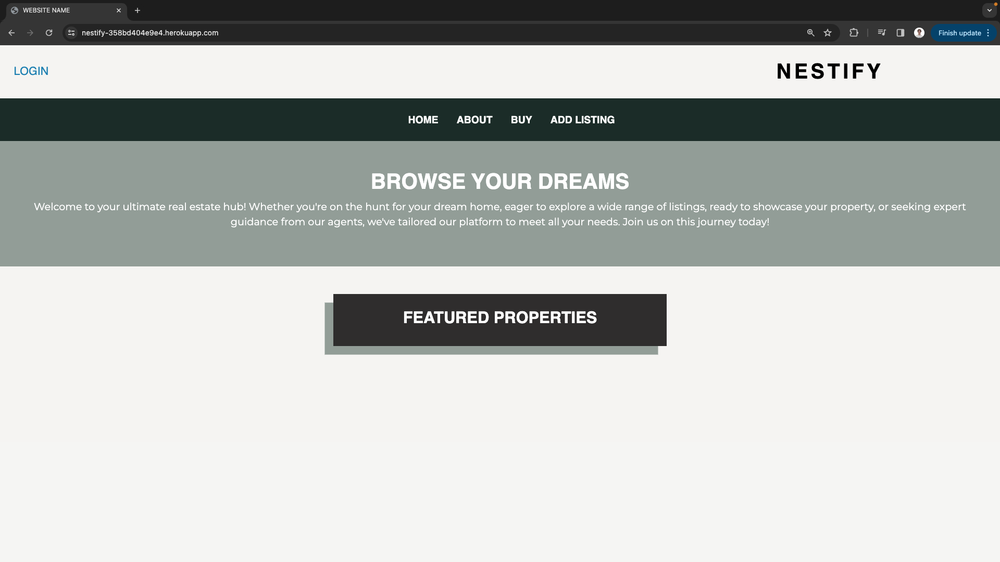
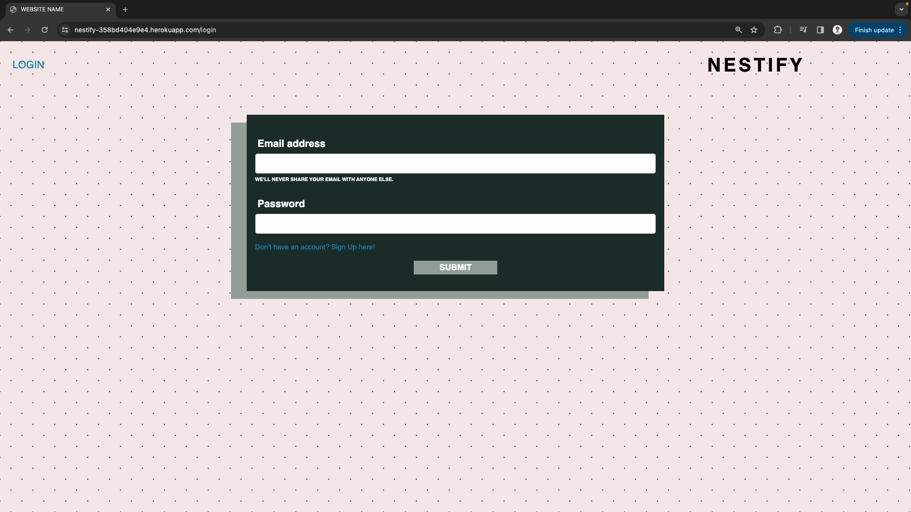
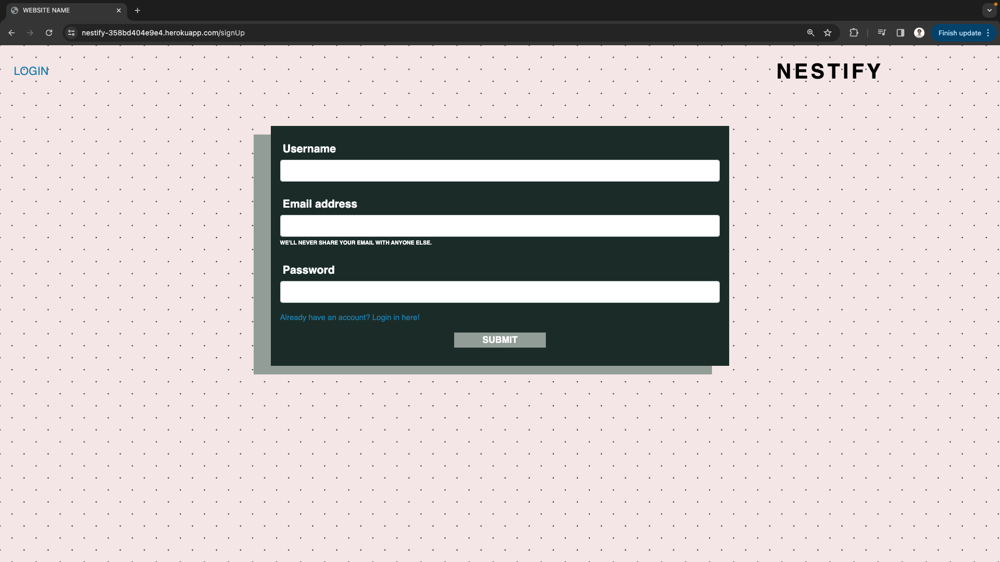

# Nestify

 

 ## Description
  Nestify is meant to make listing your property or rental a breeze. The user is easily able to make listings once they have an account for others to browse by location, property type or listing type. Nestify is meant to simplify the process of making a realestate listing and allow the users to start connecting with intersted buyers or renters quickly. Nestify uses Handlebars.js and bootstrap for the front end, the back end uses node, express, MySQL and Sequilzie for all routers and database interaction. The multer npm package is used to upload files with the new listing to the server. All login functionality is handled with express-session. 

  ## Installation 
  N/A 

  ## Usage
  A new user is able to create an account on the sign in page from the home page. Once the user is signed in you are able to view listings on the listings page and are able to create a listing on the add listing page where you are presented with a form to fill in your listing details.

 Initial Load Screen:
  
 Log in page:
  
 Sign Up Page:
  

  ## License
  MIT License

  ## Questions
  [Github Profile](https://github.com/garrethil)

  For any further questions you may contact: garrethildebrandt@gmail.com